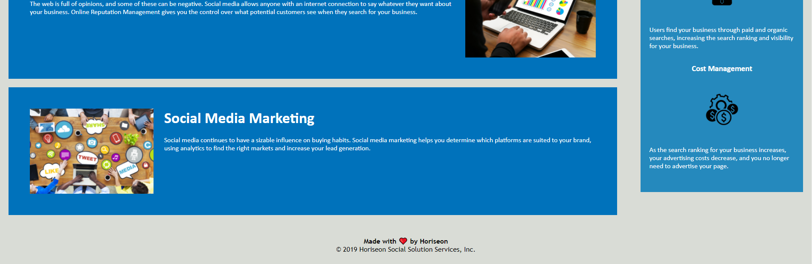

This website is ment to provide information 
about how SEO can improve your business'.

The header holds the company name and 
a few quick navigation buttons. They are 
labeled Search Engine Optimization, 
Online Reputation Management, 
and Social Media Marketing.

When each are pressed they navigate 
the user to the topics of their respective buttons.

First thing on the page, a Hero image of a round 
table meeting where all participants are 
talking about a project.

After scrolling past the hero image 
will be the information talked about before. 
To the right of the information are the 
benefits to your company when you impliment SEO practices.

In the Footer it reads 
"made with ❤️ by Horiseon" 
and below that 
"&copy; 2019 Horiseon Social Solution Services, Inc."

Deployed:
https://revivedaniel.github.io/new-horiseon/

Screenshots:

Updating this branch
asdkfaskjdfkhasf